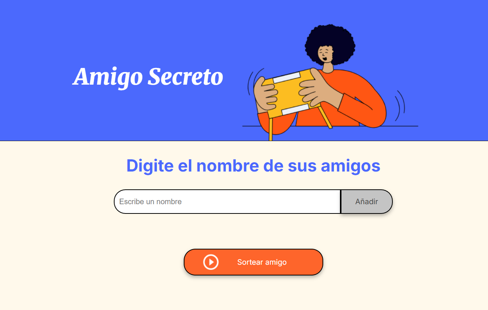
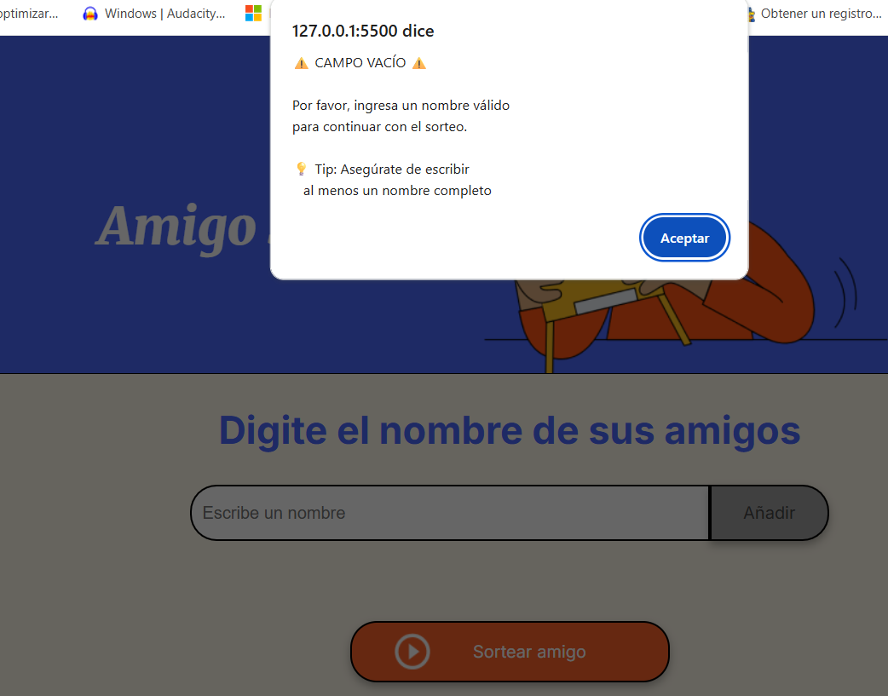
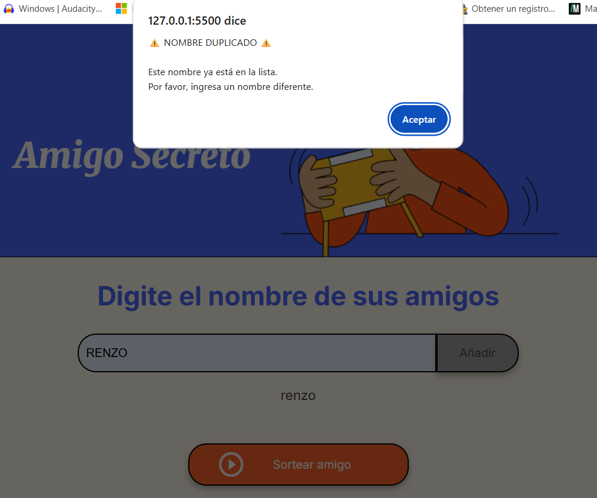
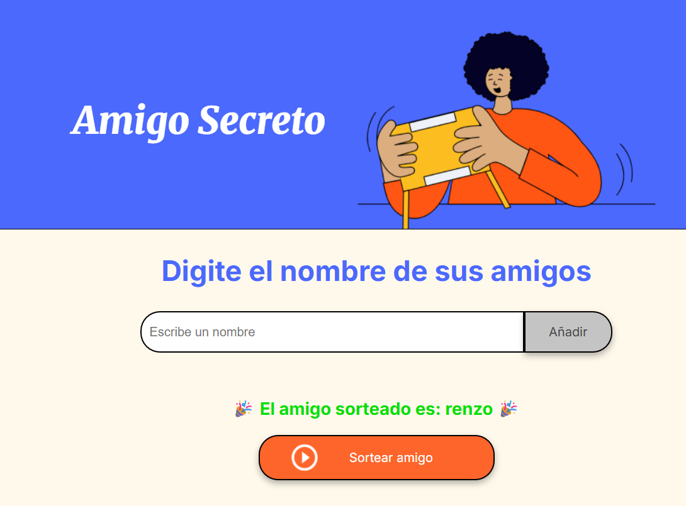

# Challenge Amigo Secreto 🎁

**Challenge Amigo Secreto** es una aplicación web desarrollada en **HTML** y **JavaScript** que permite organizar sorteos de amigo secreto de manera sencilla y divertida. Ideal para reuniones, fiestas y eventos donde quieras sorprender a tus amigos.

## 🚀 Características principales

- Añade nombres de participantes a través de un campo de texto y un botón.
- **Validación de datos:**  
  - Si el campo de nombre está vacío, muestra una alerta indicando que debes ingresar un nombre válido.
  - Si el nombre ya fue ingresado, muestra una alerta indicando que el nombre es duplicado.
- Realiza el sorteo aleatorio de un amigo secreto con solo un clic.
- Si la lista está vacía al intentar sortear, muestra una alerta indicando que la lista está vacía.
- Muestra el resultado del sorteo en pantalla.
- Utiliza lógica condicional, arrays, funciones y manejo de eventos para lograr el funcionamiento.

## 📸 Capturas de pantalla

Puedes colocar tus imágenes dentro de una carpeta llamada `img/` en tu repositorio y enlazarlas aquí, por ejemplo:

```markdown
## 📸 Capturas de pantalla

  
  
  

```

## 📦 Instalación y uso

1. **Clona el repositorio:**

```bash
git clone https://github.com/rluzav/challenge-amigo-secreto.git
cd challenge-amigo-secreto
```

2. **Abre el archivo `index.html` en tu navegador favorito.**

¡No se requiere instalación adicional!

## 🛠️ ¿Cómo funciona?

1. Ingresa el nombre de un participante en el campo de texto.
2. Haz clic en el botón **Añadir** para agregar el nombre a la lista.
3. Si el campo está vacío, aparecerá una alerta solicitando ingresar un nombre válido.
4. Si el nombre se repite, aparecerá una alerta indicando nombre duplicado.
5. Una vez que todos los nombres estén ingresados, haz clic en **Sortear Amigo**.
6. Si la lista está vacía al intentar sortear, aparecerá una alerta indicándolo.
7. La aplicación seleccionará aleatoriamente uno de los nombres y lo mostrará en pantalla como el amigo secreto.

## 🤝 Contribuciones

¿Quieres mejorar la aplicación? ¡Bienvenido!

1. Haz un fork del repositorio.
2. Crea una rama para tu mejora (`git checkout -b mejora/nueva-funcionalidad`)
3. Realiza tus cambios y haz commit (`git commit -m 'Agrega nueva funcionalidad'`)
4. Haz push a la rama (`git push origin mejora/nueva-funcionalidad`)
5. Abre un Pull Request.

## 📄 Licencia

Este proyecto está bajo la licencia MIT.

---

> Si tienes ideas para nuevas funciones o mejoras, ¡no dudes en crear una issue!
